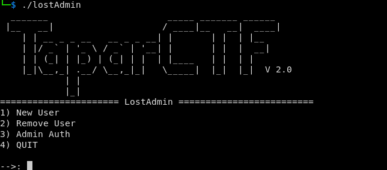
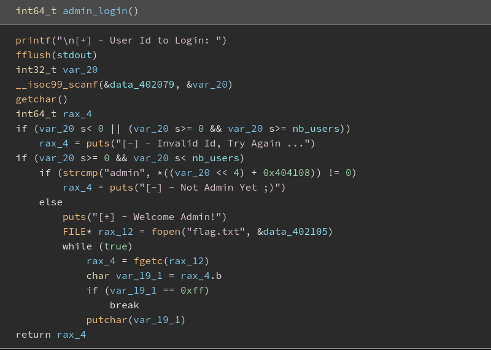

# lostAdmin Challenge (medium)

<kbd>436 points</kbd>

## question 

Our Administrator Has lost the Password! We don't Panic, We you You are gonna help us.

`nc challs1.taparctf.ir 7001`


Format: `Tapar{flag}` Author: `exploitio`

**Hint** : After Freedom!

**Hint** : use after free!




Attachments: 

- [lostAdmin](./assets/lostadmin/lostAdmin)


## answer

First, we need to decompile the elf file. I use [Binary Ninja Cloud](https://cloud.binary.ninja/) to decompile and simplify elf file.

> if you want, to figure out content type of the attachment file, just need to type `file lostAdmin` on bash and its result is: 
>
> `lostAdmin: ELF 64-bit LSB executable, x86-64, version 1 (SYSV), dynamically linked, interpreter /lib64/ld-linux-x86-64.so.2, for GNU/Linux 3.2.0, not stripped`

after analyzing the elf file by ninja, we search for a function that check a user is admin or not!



in `admin_login` function, we see that finally the program check `admin` string with a point of memory.

so, just we should calculate this address of memory or make a good guess!

In First, I tried to calculate target address of memory, but finally (Considering that the original source code was not available), i have to  make some guess and try them!

In my calculates, for every add user, entered username string, set on an address that calculated with this:

```
address = user index * 16 + 0x404100
```

According to the hints, we must use remove user operation. Also according to the `admin_login` code, even user with index 0, can be admin! but how?

> based on the source code, username of every inserted users, its better to be `admin`

After all analyzing the source code and hints, i starting to test my guesses like:

- insert, insert, insert, check index 2

- insert, remove index 0, check index 0

- insert, insert, remove index 0, check index 1

- insert, remove index 0, insert, check index 0

- **insert, remove index 0, insert, insert, check index 0**


**`Tapar{Adm!n_0f_A11_SiSt3ms_uh3iuh17eh12}`**

## author

- name: TaparCTF 2

- written by: madkne in 2023.05.09

- website: http://taparctf.ir/
