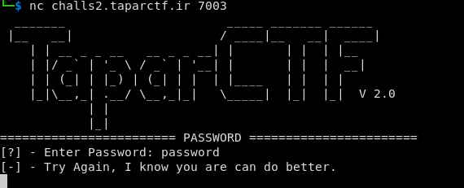

# password Challenge (medium)

## question 

My Password is secure, I don't know it either!?

`nc challs2.taparctf.ir 7003`


Format: `Tapar{flag}` Author: `exploitio`




Attachments: 

- [password.c](./assets/password/password.c)
- [password](./assets/password/password)

## answer

First I checked `password.c` source code, and find password checker algorithm, then need to program a script to generate a password by this algorithm.

so, i create `password_solver.js` script:

```js


let password = '';
let target_sum = 0xdead;
let sum = 0xbabe;
let alphabets = ["A", "B", "C", "D", "E", "F", "G", "H", "I", "J", "K", "L", "M", "N", "O", "P", "Q", "R", "S", "T", "U", "V", "W", "X", "Y", "Z"];
for (let i = 0; i < 1000; i++) {
    // =>find best alphabet
    let alpha = 'A';
    let diff = target_sum - sum;
    for (const alphabet of alphabets) {
        if (diff % alphabet.charCodeAt(0) === 0) {
            alpha = alphabet;
            break
        }
    }
    sum += alpha.charCodeAt(0);
    password += alpha;
    if (sum === target_sum) break;
}

console.log('password:', password, password.length, sum);

```

in result, i got this:

```

password: AAAAAWWKEEEEEEEEEEEEEEEBBBBBBBBBBBBBBBBBBBBBBBBBBBBBBBBBBBBBBBBBBBBBBBBBBAAAAAAAAAAAAAAAAAAAAAAAAAAAAAAAAAAAAAAAAAAAAAAAAAAAAAAAAAAAAAAAAAA 139 57005

```

then just need to set password on `nc challs2.taparctf.ir 7003` server and get the flag:

**`Tapar{I_C4N_Br3ak_iT_63uheju39d}`**

## author

- name: TaparCTF 2

- written by: madkne in 2023.05.08

- website: http://taparctf.ir/
